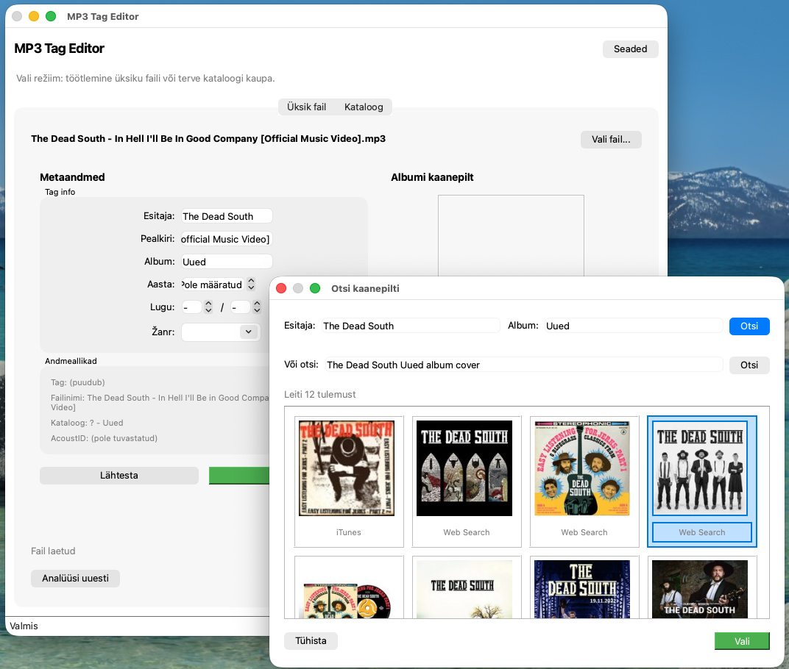
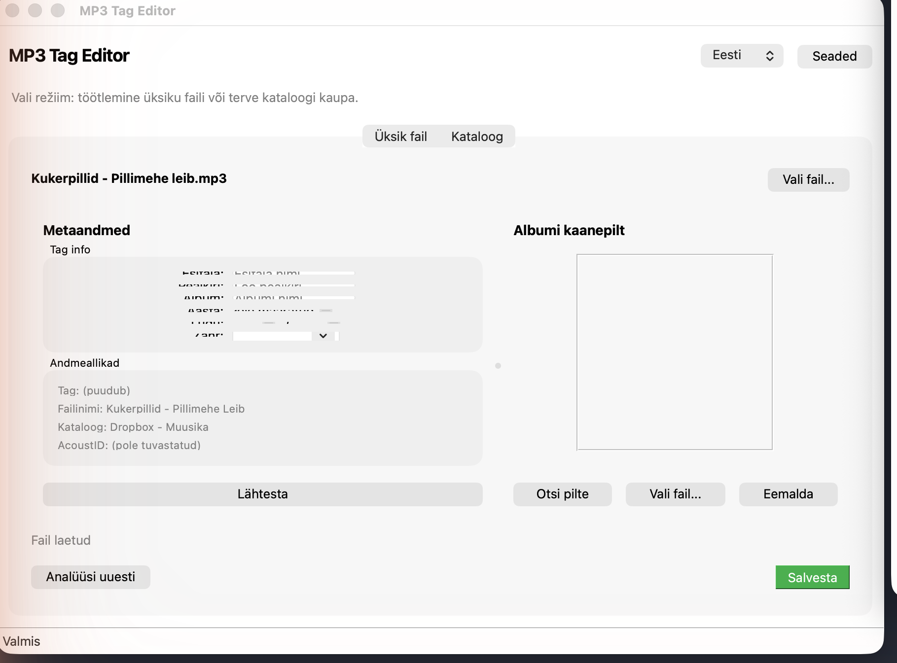

# MP3 Album Art Tag Fixer

A desktop application for managing MP3 file metadata and automatically fetching album artwork from multiple online sources.

## Features

- **Album Artwork Fetching** - Automatically find and embed album art from multiple providers:
  - MusicBrainz
  - Last.fm
  - Discogs
  - iTunes
  - Google Images

- **Audio Fingerprinting** - Identify tracks accurately using AcoustID/Chromaprint, even when tags are missing or incorrect

- **Smart Metadata Detection** - Extracts information from:
  - Existing ID3 tags
  - Filename patterns (e.g., `01 - Artist - Title.mp3`)
  - Directory structure (e.g., `Artist/Album/`)

- **Batch Processing** - Process entire directories at once

- **Conflict Resolution** - When multiple sources disagree, review and choose the correct metadata

- **Preview Changes** - See all proposed changes before saving them

- **Caching** - API responses are cached to speed up repeated lookups

- **Bilingual Interface** - Full support for Estonian and English
  - Language switcher in top-right corner
  - Auto-detects system language on first run
  - Switch languages without restarting

## Screenshots

**Artwork Picker** - Choose from multiple artwork sources


**Main Window** - Edit metadata and view album artwork


## Installation

### Prerequisites

- Python 3.10 or higher
- [Chromaprint](https://acoustid.org/chromaprint) (for audio fingerprinting)

#### Installing Chromaprint

**macOS:**
```bash
brew install chromaprint
```

**Ubuntu/Debian:**
```bash
sudo apt install libchromaprint-tools
```

**Windows:**

Download from [AcoustID Chromaprint](https://acoustid.org/chromaprint) and add `fpcalc.exe` to your PATH.

### Install the Application

1. Clone the repository:
```bash
git clone https://github.com/raivo/mp3-albumart-tag-fixer.git
cd mp3-albumart-tag-fixer
```

2. Create a virtual environment (recommended):
```bash
python -m venv venv
source venv/bin/activate  # On Windows: venv\Scripts\activate
```

3. Install dependencies:
```bash
pip install -r requirements.txt
```

## Usage

Launch the application:
```bash
python main.py
```

Or open a specific file/directory:
```bash
python main.py /path/to/music
```

### Command Line Options

```
python main.py --help     # Show help
python main.py --version  # Show version
python main.py --check    # Check dependencies
```

## Configuration

The application stores its configuration in `~/.mp3_tag_editor/config.json`.

### API Keys (Optional)

For better results, you can configure API keys for some services:

- **Last.fm** - Get a free API key at [Last.fm API](https://www.last.fm/api/account/create)
- **Discogs** - Generate a token at [Discogs Developer Settings](https://www.discogs.com/settings/developers)
- **AcoustID** - Register at [AcoustID](https://acoustid.org/api-key)

API keys can be configured in the application settings dialog.

## Project Structure

```
mp3-albumart-tag-fixer/
├── main.py              # Application entry point
├── config.py            # Configuration management
├── requirements.txt     # Python dependencies
├── core/                # Core functionality
│   ├── analyzer.py      # Audio file analysis
│   ├── fingerprint.py   # Audio fingerprinting
│   ├── matcher.py       # Metadata matching logic
│   └── tagger.py        # ID3 tag writing
├── models/              # Data models
│   ├── track.py         # Track representation
│   └── album.py         # Album representation
├── parsers/             # Metadata extraction
│   ├── filename_parser.py
│   ├── directory_parser.py
│   └── patterns.py      # Regex patterns
├── artwork/             # Album art fetching
│   ├── fetcher.py       # Main fetcher logic
│   └── providers/       # Individual API providers
├── gui/                 # PySide6 GUI
│   ├── main_window.py
│   ├── artwork_picker.py
│   └── widgets/         # Reusable UI components
└── utils/               # Utilities
    ├── cache.py         # Disk caching
    ├── image_utils.py   # Image processing
    ├── translations.py  # Bilingual support (ET/EN)
    └── validators.py    # Input validation
```

## Dependencies

| Package | Purpose |
|---------|---------|
| PySide6 | GUI framework |
| mutagen | MP3 tag reading/writing |
| pyacoustid | Audio fingerprinting |
| httpx | HTTP client for API requests |
| Pillow | Image processing |
| diskcache | Persistent caching |
| musicbrainzngs | MusicBrainz API client |

## License

MIT License - see [LICENSE](LICENSE) for details.

## Contributing

Contributions are welcome! Please feel free to submit a Pull Request.
